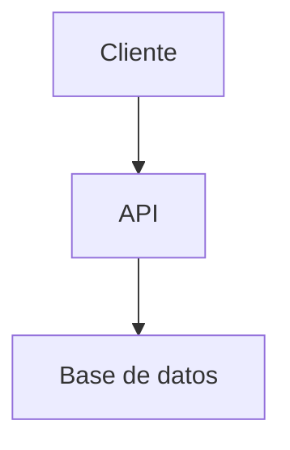

# Arquitectura

> Tier T3: crear cuando el sistema tiene complejidad suficiente para necesitar un mapa.
> Nota de plantilla: el diagrama y los componentes aquí son de ejemplo hasta documentar la arquitectura real.

## Overview

<!-- Descripción de alto nivel del sistema (3-5 líneas) -->

## Componentes

<!-- Diagrama Mermaid o descripción de componentes principales -->

## Decisiones arquitectónicas

Ver `docs/decisions/` para Architecture Decision Records (ADRs).
